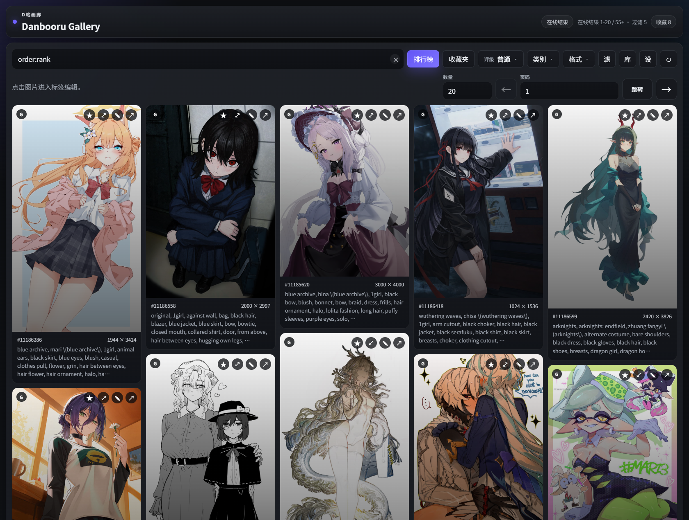
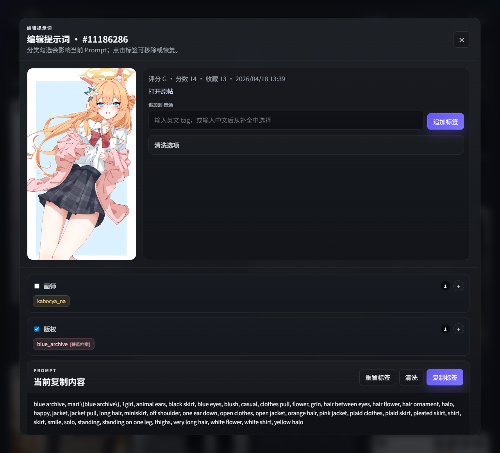

# Danbooru Gallery Standalone

Standalone web version of the Danbooru Gallery workflow, extracted from a ComfyUI plugin and rebuilt as a one-click local app.

[简体中文](#简体中文) | [English](#english)

## Download

- Releases:
  [GitHub Releases](https://github.com/RAMU324E/danbooru-gallery-standalone-web/releases)
- Source one-click start:
  `start_web.bat`





## English

### Overview

This repository is a standalone web port of the Danbooru-related workflow from the original ComfyUI plugin:

- Original project: https://github.com/Aaalice233/ComfyUI-Danbooru-Gallery
- Related workflow: https://github.com/Aaalice233/ShiQi_Workflow

The goal of this version is to keep the practical Danbooru browsing and prompt editing experience, while removing the dependency on ComfyUI itself.

### Features

- Danbooru image search with gallery-style browsing
- Tag autocomplete with Chinese translation support
- Prompt editing by tag category
- Prompt cleaning and formatting tools
- Clipboard copy for final prompt output
- Local prompt library with import/export
- Local one-click startup for Windows
- Optional Danbooru account favorite sync
- Local favorite fallback when no Danbooru account is configured

### What This Version Focuses On

This standalone version currently focuses on the parts that are useful outside ComfyUI:

- searching Danbooru posts
- selecting and editing tags
- cleaning and formatting prompts
- maintaining a reusable prompt library
- copying prompts into other tools

It does not attempt to reproduce every ComfyUI-specific integration from the original plugin. Workflow-bound features such as Krita/ComfyUI node interaction are intentionally out of scope for this repository.

### Quick Start

#### Windows one-click start

```bat
start_web.bat
```

The script will:

1. create `.venv` if missing
2. install dependencies from `requirements.txt`
3. start the local web app

Default address:

```text
http://127.0.0.1:36741
```

If the port is occupied, the app automatically falls back to a nearby free high port and prints the actual URL in the console.

#### Manual start

```bash
python -m venv .venv
.venv\Scripts\activate
pip install -r requirements.txt
python run.py
```

### Deployment Notes

For simple local deployment:

1. Install Python 3.11+.
2. Clone this repository.
3. Run `start_web.bat`.

The project is already structured around a single local entrypoint, so packaging with tools such as `PyInstaller` can be added later without changing the core app architecture.

### Project Layout

- `app/`
  FastAPI backend, static frontend, bundled translation data, and bundled tag database
- `run.py`
  local server launcher
- `start_web.bat`
  Windows one-click launcher
- `docs/images/`
  README screenshots

### Notes

- This project is derived from the original MIT-licensed repository above.
- Runtime data such as settings, local favorites, logs, and preview caches are generated under `data/` and `logs/`.
- No personal account settings are committed in this public repository.

### License

MIT. See [LICENSE](LICENSE).

## 简体中文

### 下载

- Releases：
  [GitHub Releases](https://github.com/RAMU324E/danbooru-gallery-standalone-web/releases)
- 源码一键启动：
  `start_web.bat`

### 项目简介

这是一个从原始 ComfyUI 插件中拆分出来的独立 Web 版本，目标是保留 Danbooru 检索、标签编辑、提示词清洗等核心体验，同时不再依赖 ComfyUI 本体。

- 原项目地址：https://github.com/Aaalice233/ComfyUI-Danbooru-Gallery
- 相关工作流：https://github.com/Aaalice233/ShiQi_Workflow

### 当前功能

- Danbooru 图片检索与瀑布流浏览
- tag 自动补全与中文翻译
- 按分类编辑标签
- Prompt 清洗与格式化
- 一键复制最终 Prompt
- 本地 Prompt 词库管理
- 词库导入 / 导出
- Windows 一键启动
- Danbooru 账号收藏同步
- 未配置账号时的本地收藏兜底

### 这一版的定位

这一版主要覆盖脱离 ComfyUI 之后仍然高频有用的部分：

- 搜图
- 选 tag
- 编辑提示词
- 清洗提示词
- 管理词库
- 复制结果到其他绘图或文本工具

像 Krita 联动、ComfyUI 节点工作流内交互这类强依赖宿主环境的能力，不是这个仓库当前的目标。

### 启动方式

#### Windows 一键启动

```bat
start_web.bat
```

脚本会自动：

1. 创建 `.venv`
2. 安装依赖
3. 启动本地 Web 服务

默认地址：

```text
http://127.0.0.1:36741
```

如果端口被占用，程序会自动切换到附近空闲端口，并在控制台打印实际地址。

#### 手动启动

```bash
python -m venv .venv
.venv\Scripts\activate
pip install -r requirements.txt
python run.py
```

### 简单部署说明

本项目目前更偏向“本地工具”部署：

1. 安装 Python 3.11+
2. 克隆仓库
3. 运行 `start_web.bat`

当前结构已经适合后续再增加 `PyInstaller` 打包，不需要先重构主程序入口。

### 目录说明

- `app/`
  后端、前端静态页、翻译数据、标签数据库等核心代码
- `run.py`
  本地服务启动入口
- `start_web.bat`
  Windows 一键启动脚本
- `docs/images/`
  README 展示截图

### 说明

- 本仓库基于原项目 MIT 许可整理而来
- `data/`、`logs/` 等运行目录会在首次启动后自动生成
- 公开仓库不包含个人账号配置与私有运行数据

### 许可证

MIT，详见 [LICENSE](LICENSE)。
